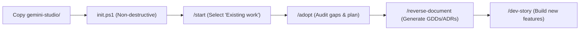

# Gemini Code Game Studio (GCGS)

> **Transform Gemini and Antigravity into a full-scale professional game development studio for Unity 6 LTS (C#).**  
> 49 coordinated specialist roles. 74 progressive skills. Native Windows lifecycle hooks. Zero-pollution architecture.

[](LICENSE)
[](https://unity.com/)
[](https://github.com/Donchitos/Claude-Code-Game-Studios)

---

## 🌟 Overview

**Gemini Code Game Studio (GCGS)** brings the rigor, discipline, and multi-agent coordination of a AAA game studio directly into Google Gemini and Antigravity IDE.

All studio intelligence, specialist roles, skills, and documentation are encapsulated inside a single portable directory: **[`gemini-studio/`](gemini-studio/README.md)**. You can drop this directory into any new or existing Unity project to instantly empower your AI assistant with professional game studio workflows.

---

## 🚀 Quick Start: How to Use in Any Unity Project

Using Gemini Code Game Studio takes only **3 simple steps**, whether you are starting fresh or adopting it into an active project:

### Step 1: Open or Create your Unity project
- **New Project**: Create a new project via **Unity Hub** (Unity 6 LTS recommended).
- **Existing Project**: Open the root folder of your existing Unity game.

### Step 2: Copy `gemini-studio/` into your project root
Copy the single `gemini-studio/` folder from this repository into your Unity project's root:

```
YourUnityProject/
├── Assets/                 # Your game assets (untouched!)
├── Packages/               # Package manifest (untouched!)
├── ProjectSettings/        # Project settings (untouched!)
└── gemini-studio/          <-- Copy ONLY this folder here!
```

### Step 3: Run the initial setup script
Open PowerShell in your Unity project root and execute:

```powershell
powershell -ExecutionPolicy Bypass -File ./gemini-studio/init.ps1
```

`init.ps1` automatically:
- Configures the Antigravity studio bridge (`GEMINI.md`, `.agents/skills.json`, `.agents/hooks.json`).
- **If your project is new** (`Assets/Scripts` does not exist): Scaffolds recommended modular Assembly Definitions (`Studio.Core`, `Studio.Gameplay`, `Studio.UI`, `Tests`).
- **If your project is existing** (`Assets/Scripts` already exists): **Preserves 100% of your code and folders untouched.**

Open the project in Antigravity or your AI editor and type `/start`!

---

## 🔄 Working with Existing / Advanced Projects (Brownfield)

Already have an ongoing game in development? **Gemini Code Game Studio is non-intrusive and brownfield-ready.** It will **never** overwrite your existing scripts, scenes, or packages, and adapts seamlessly to your established codebase.

### Brownfield Adoption Pipeline:



1. **Stage Auto-Detection (`/start` or `/project-stage-detect`)**:
   - Type `/start` in the chat and select **`D) Existing work`**.
   - The studio scans your codebase: if it detects existing C# scripts, it automatically identifies your stage as **Pre-Production** or **Production**.
   - It bypasses introductory brainstorm steps for systems that you've already built.

2. **Brownfield Gap Audit (`/adopt`)**:
   - Run `/adopt` to audit your current codebase against studio best practices.
   - It generates a prioritized, non-blocking adoption report in `gemini-studio/docs/adoption-plan-[date].md` highlighting undocumented mechanics, missing test suites, or performance bottlenecks.

3. **Reverse-Engineering Existing Code into Documentation (`/reverse-document`)**:
   - Don't waste time typing GDDs or architecture documents for systems you already coded!
   - `/reverse-document design Assets/Scripts/Combat` — The **Game Designer** analyzes your combat scripts and writes a complete Game Design Document (GDD) with mechanics, math, and state machines.
   - `/reverse-document architecture Assets/Scripts/Core` — The **Technical Director** inspects your core code and drafts Architecture Decision Records (ADRs).

4. **Safe Expansion (`/quick-design` & `/create-stories`)**:
   - Add new features or refactor legacy code using `/create-stories` and `/dev-story`. The AI respects your existing conventions, namespaces, and patterns.

---

## 🧭 Core Workflow Commands

Interact with the studio using slash commands in your AI chat:

| Command | Specialist Role | Purpose |
| :--- | :--- | :--- |
| **`/start`** | Producer | Guided onboarding and repository state diagnosis. |
| **`/brainstorm`** | Creative Director | Game concept ideation and brief authoring (for new features or games). |
| **`/adopt`** | Technical Director | Brownfield audit and non-breaking migration plan for existing games. |
| **`/reverse-document`** | Game Designer / TD | Reverse-engineer GDDs and ADRs from existing C# code. |
| **`/design-system <name>`** | Systems Designer | System GDD authoring with formulas and edge cases. |
| **`/create-stories <epic>`** | Lead Programmer | Break systems into single-session developer stories. |
| **`/dev-story <path>`** | Specialist Team | Implement code with architecture proposals, unit tests, and visual QA. |

For the complete list of 74 workflow skills, see the **[Skills Cheatsheet](gemini-studio/README.md#workflow-skills-cheatsheet)**.

---

## 🛡️ Non-Negotiable Directives (Strict & Automated)

1. **Unity Hub Genesis**: All Unity projects MUST be created via Unity Hub (`ProjectSettings/ProjectVersion.txt` must exist).
2. **No Direct Package Manifest Modification**: The AI will **NEVER** edit `Packages/manifest.json`. All packages must be installed by the user through the Unity Editor Package Manager (`Window > Package Manager`). The AI guides you and confirms installation via read-only check.
3. **Data-Driven Architecture**: Gameplay parameters are stored in `ScriptableObject` assets (`Assets/Scripts/Data/`).
4. **Decoupled Systems**: Assembly Definitions (`.asmdef`) isolate Core, Gameplay, UI, and Tests.
5. **Run & Observe**: Visual and gameplay features require runtime observation and verification screenshots saved in `gemini-studio/production/qa/evidence/`.

---

## 📂 Repository Contents

```
00 Gemini Code Game Studio/
├── gemini-studio/                 # The Portable Studio (Everything is here)
│   ├── README.md                  # Studio framework documentation & cheatsheet
│   ├── project.yaml               # Studio configuration
│   ├── init.ps1                   # One-click portable setup script
│   ├── .agents/                   # 49 Agents, 74 Skills, Rules & Windows Hooks
│   ├── design/                    # GDDs, narrative bibles & mechanics
│   ├── docs/                      # Architecture, ADRs, templates, engine reference
│   └── production/                # Sprints, session checkpoint & QA evidence
├── GEMINI.md                      # AI studio bridge file
├── LICENSE                        # MIT License
└── README.md                      # This file
```

---

## 💖 Credits & Acknowledgments

**Gemini Code Game Studio (GCGS)** is an adaptation and evolution of the outstanding open-source project **[Claude Code Game Studios (CCGS)](https://github.com/Donchitos/Claude-Code-Game-Studios)**, created by **[Donchitos](https://github.com/Donchitos)**.

- **Original Architecture & Concept**: The 49-agent studio hierarchy, 7-phase game development pipeline, collaboration protocol (*Question → Options → Decision → Draft → Approval*), and foundational skills/templates were originally designed and engineered by Donchitos for Claude Code.
- **Gemini / Antigravity Evolution**: Adapted to Google DeepMind's Gemini and Antigravity ecosystem with native Windows PowerShell lifecycle hooks, `.agents/` customizations, progressive disclosure, and first-class Unity 6 LTS scaffolding.
- **Support the Original Creator**: If you find this studio architecture valuable, please consider supporting Donchitos:
  - ☕ [Buy Me a Coffee](https://www.buymeacoffee.com/donchitos3)
  - 💖 [GitHub Sponsors](https://github.com/sponsors/Donchitos)
  - ⭐ [Claude Code Game Studios on GitHub](https://github.com/Donchitos/Claude-Code-Game-Studios)

---

## 📄 License

This project is licensed under the [MIT License](LICENSE).
